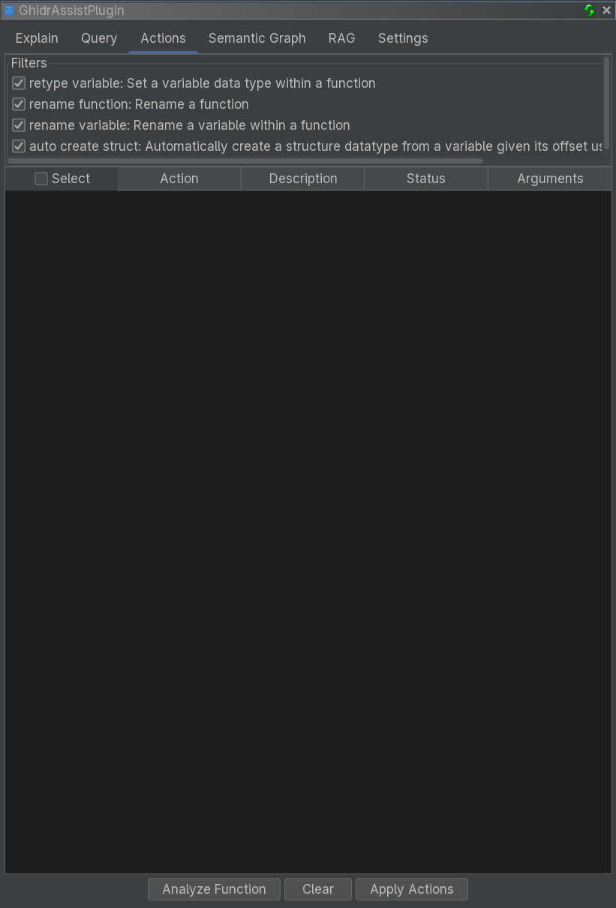

# Actions Tab Reference

The Actions tab provides LLM-powered suggestions for improving analysis, such as renaming functions, variables, retyping, and struct creation.

<!-- SCREENSHOT: Actions tab showing action checkboxes, Analyze Function button, and results table -->

## Purpose

The Actions tab automates common reverse engineering cleanup tasks:

- Suggest meaningful function names
- Propose descriptive variable names
- Recommend better data types
- Generate structure definitions from access patterns

Each suggestion includes structured arguments and can be applied directly.

## Action Types

### Rename Function

Suggests a semantic name for the current function based on behavior.

### Rename Variable

Suggests clearer variable names based on usage patterns.

### Retype Variable

Proposes more accurate data types based on usage.

### Auto Create Struct

Generates structure definitions from offset access patterns.

## UI Elements

### Action Selection

Checkboxes let you choose which action types to analyze. All are enabled by default.

### Buttons

| Button | Description |
|--------|-------------|
| **Analyze Function** | Generate suggestions for selected action types |
| **Clear** | Clear the results table |
| **Apply Actions** | Apply checked suggestions |

### Results Table

| Column | Description |
|--------|-------------|
| **Select** | Checkbox to apply action |
| **Action** | Action type |
| **Description** | Human-readable summary |
| **Status** | Pending / Success / Failed |
| **Arguments** | Structured parameters for the action |

### Select All Header

The Select column header includes a checkbox to toggle all rows.

## Workflow

1. Navigate to a function in Ghidra
2. Open Actions tab
3. Select action types
4. Click **Analyze Function**
5. Review suggestions
6. Check the ones to apply
7. Click **Apply Actions**

## Tips

- Review suggestions before applying
- Use Explain or Query tabs to understand functions first
- Apply changes incrementally

## Related Documentation

- [Explain Tab](explain-tab.md)
- [Query Tab](query-tab.md)
- [Settings Tab](settings-tab.md)
