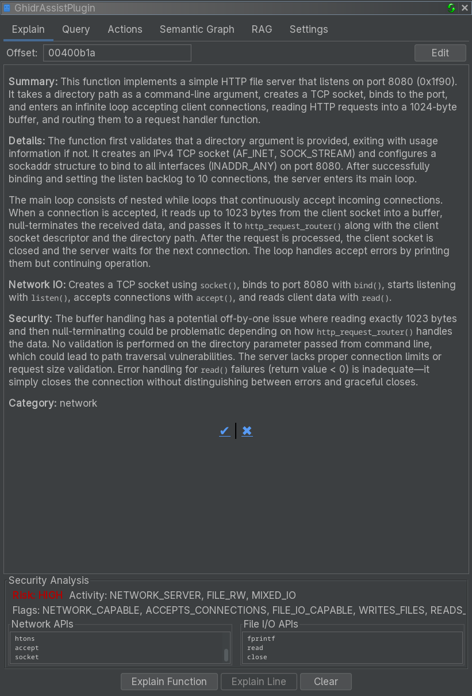

# Explain Tab Reference

The Explain tab generates and stores LLM-powered explanations of functions, with integrated security analysis and editing support.

<!-- SCREENSHOT: Explain tab showing a function explanation with the security panel visible below -->

## Purpose

The Explain tab helps you build a documented understanding of a binary by:

- Generating detailed function explanations
- Providing security assessments and risk indicators
- Storing explanations for later reference
- Allowing you to edit and refine the output

## UI Elements

### Analysis Buttons

| Button | Description |
|--------|-------------|
| **Explain Function** | Analyze the entire current function |
| **Explain Line** | Statement-level analysis (coming soon) |
| **Clear** | Clear stored analysis for the current function |

**Explain Line** is currently disabled and marked as coming soon in GhidrAssist.

### Enhancement Options

GhidrAssist uses the global settings from the Query tab and Settings tab:

- **RAG**: Enable document context (see [RAG Tab](rag-tab.md))
- **MCP**: Enable tool calling for enhanced analysis

### Display Area

The main display area renders the LLM response as markdown, including:

- Function purpose and behavior
- Parameter and return value analysis
- Notable implementation details

### Security Analysis Panel

<!-- SCREENSHOT: Expanded security analysis panel showing Risk Level, Activity Profile, Flags, Network APIs, File I/O APIs -->

| Field | Description |
|--------|-------------|
| **Risk Level** | Overall security assessment (Low, Medium, High) |
| **Activity Profile** | Behavior category (e.g., "Network Communication") |
| **Security Flags** | Detected patterns and risks |
| **Network APIs** | Network-related calls detected |
| **File I/O APIs** | File operations detected |

The panel is hidden until analysis data is available.

### Edit Mode

Use the **Edit** button to modify explanations:

1. Click **Edit** to switch to markdown mode
2. Modify the content
3. Click **Save** to store changes

Edits are persisted in the analysis database and protected from auto-overwrite.

### Feedback

Use the thumbs up/down buttons to provide feedback on explanation quality.

## Function Context

The Explain tab tracks the current function based on the Ghidra cursor. If no function is selected, analysis buttons are disabled.

## Stored Explanations

Explanations are stored by:
- Binary SHA256 hash
- Function address

This allows you to return to the same function later and see the saved explanation.

## Related Documentation

- [Explain Workflow](../workflows/explain-workflow.md)
- [Query Tab](query-tab.md)
- [Settings Tab](settings-tab.md)
