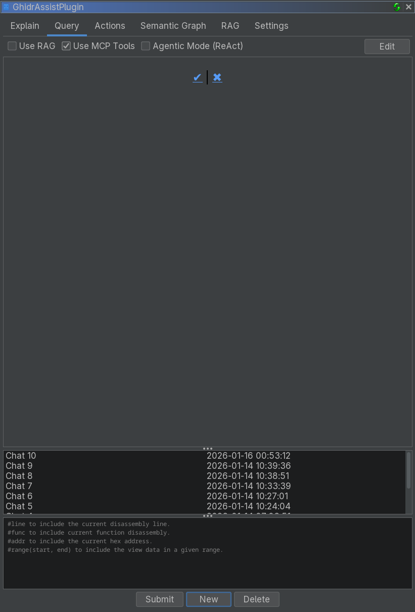

# Query Tab Reference

The Query tab provides an interactive chat interface for questions about your binary, with context macros, MCP tools, and the ReAct agent.


<!-- SCREENSHOT: Query tab showing chat history on the left, response panel, and input box with Submit button -->

## Purpose

The Query tab enables free-form conversation with the LLM about your binary. It supports:

- Follow-up questions and multi-turn chats
- Context macros for function and address data
- MCP tool calling for interactive analysis
- ReAct autonomous agent for complex investigations

## UI Elements

### Chat History

The left panel shows saved conversations:

- **New**: Start a new chat
- **Delete**: Remove selected chat
- Each row shows a description and timestamp

### Response Area

The main panel displays:

- Your prompts
- LLM responses rendered as markdown
- Tool call outputs when MCP is enabled

### Input Area

At the bottom:

- Text input field
- **Submit** button (or Ctrl+Enter)
- **Stop** button (visible while generating)

### Enhancement Options

| Option | Description |
|--------|-------------|
| **Use RAG** | Include document context from the RAG index |
| **Use MCP Tools** | Enable tool calling |
| **Agentic Mode (ReAct)** | Enable autonomous investigation |

## Context Macros

Macros are replaced with binary context before the query is sent:

| Macro | Description |
|-------|-------------|
| `#func` | Current function code (decompiler or disassembly) |
| `#addr` | Data at the current address |
| `#line` | Current line (decompiler or disassembly) |
| `#range(start, end)` | Data in an address range |

**Example**:
```
What vulnerabilities exist in #func?
```

## MCP Tool Calling

When **Use MCP Tools** is enabled, the LLM can call tools to gather information:

Typical tool usage:
- Decompile current function
- Get cross-references
- Navigate to addresses
- Query the semantic graph

## ReAct Agent (Agentic Mode)

The ReAct agent performs multi-step investigations:

1. **Plan**: Create investigation steps
2. **Investigate**: Call tools to gather information
3. **Reflect**: Adjust plan if needed
4. **Synthesize**: Provide final answer

**Use ReAct for**:
- Complex investigations
- Vulnerability hunting
- Call graph analysis
- Exploratory reverse engineering

## Edit Mode

The Query tab supports editing chat history:

- Click **Edit** to enter markdown mode
- Modify content and save
- Changes update the stored chat history

## Related Documentation

- [Query Workflow](../workflows/query-workflow.md)
- [Settings Tab](settings-tab.md)
- [Semantic Graph Tab](semantic-graph-tab.md)
