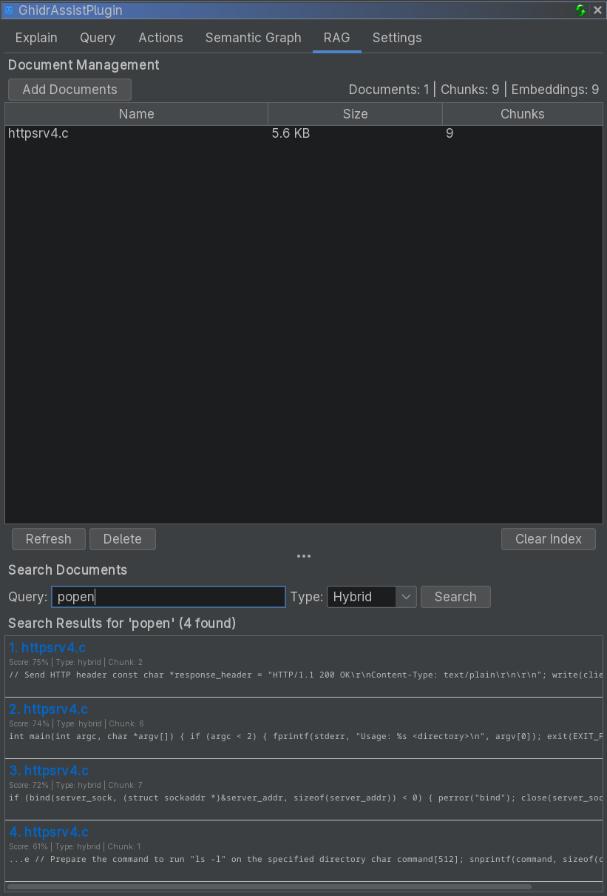

# RAG Tab Reference

The RAG (Retrieval-Augmented Generation) tab manages external documentation for context-enhanced analysis.

<!-- SCREENSHOT: RAG tab showing document table, Add/Refresh/Delete buttons, search controls, and results panel -->

## Purpose

RAG lets you import documentation (protocols, APIs, notes) so the LLM can reference it during analysis.

## UI Elements

### Document Management

- **Add Documents**: Import files
- **Refresh**: Re-index selected document
- **Delete**: Remove selected document
- **Clear Index**: Remove all indexed documents

Document table columns:

| Column | Description |
|--------|-------------|
| **Name** | Document filename |
| **Size** | File size |
| **Chunks** | Indexed chunk count |

### Search Panel

Search the index to validate results:

- **Query** input
- **Search Type**: Hybrid / Semantic / Keyword
- Results list with relevance scores

## Supported Document Types

- `.txt` (plain text)
- `.md` (markdown)
- `.pdf` (PDF text extraction)

## Search Types

| Type | Description |
|------|-------------|
| **Hybrid** | Combines keyword and semantic search |
| **Semantic** | Vector similarity search |
| **Keyword** | Traditional full-text search |

## Using RAG in Analysis

1. Import documents in the RAG tab
2. Enable **Use RAG** in the Query tab
3. Ask your question or run analysis

## Related Documentation

- [Query Tab](query-tab.md)
- [Explain Tab](explain-tab.md)
- [Settings Tab](settings-tab.md)
