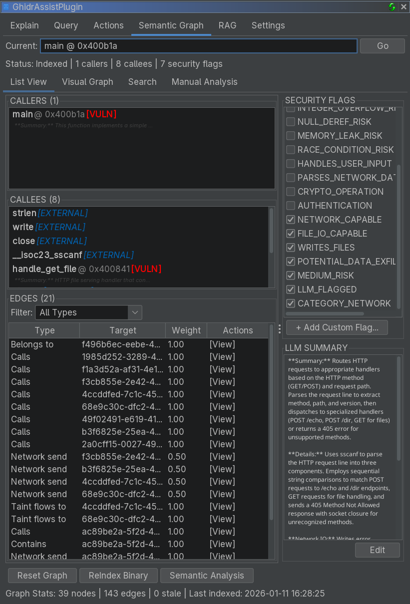

# Semantic Graph Tab Reference

The Semantic Graph tab builds and explores a knowledge graph of your binary, capturing relationships, summaries, and security properties.

<!-- SCREENSHOT: Semantic Graph tab showing List View sub-tab with function table and status header -->

## Purpose

The Semantic Graph provides:

- A call-graph-backed knowledge base
- LLM summaries and security annotations
- Taint analysis results for vulnerability detection
- Function communities for modular understanding

## Sub-Tabs

### List View

Displays indexed functions in a table:

- Address, name, summary, security flags, community labels
- Click a row to navigate to that function
- Caller/callee information is shown for the selected node

### Visual Graph

Interactive graph visualization:

- Nodes are functions
- Edges are call relationships
- N-hop depth controls exploration

<!-- SCREENSHOT: Visual Graph view with nodes and edges, one node selected -->

### Search

Full-text search across summaries and annotations:

- Search by keywords or function names
- Results include relevant excerpt snippets

### Manual Analysis

Provides fine-grained controls for analysis workflows.

## Main Controls

At the bottom of the tab:

| Button | Description |
|--------|-------------|
| **Reset Graph** | Clear all graph data for the current binary |
| **ReIndex Binary** | Build structure + security + network flow pipeline |
| **Semantic Analysis** | Run LLM summarization on stale/unsummarized nodes |

## Manual Analysis Panel

Additional analysis operations:

| Button | Description |
|--------|-------------|
| **Security Analysis** | Taint analysis for source-to-sink flows |
| **Network Flow Analysis** | Track data flow through network APIs |
| **Community Detection** | Group related functions using Label Propagation |
| **Refresh Names** | Sync graph node names with Ghidra function names |

## Graph Statistics

The status line shows:

- Current index state
- Caller/callee counts
- Security flags count

## Related Documentation

- [Semantic Graph Workflow](../workflows/semantic-graph-workflow.md)
- [Query Tab](query-tab.md)
