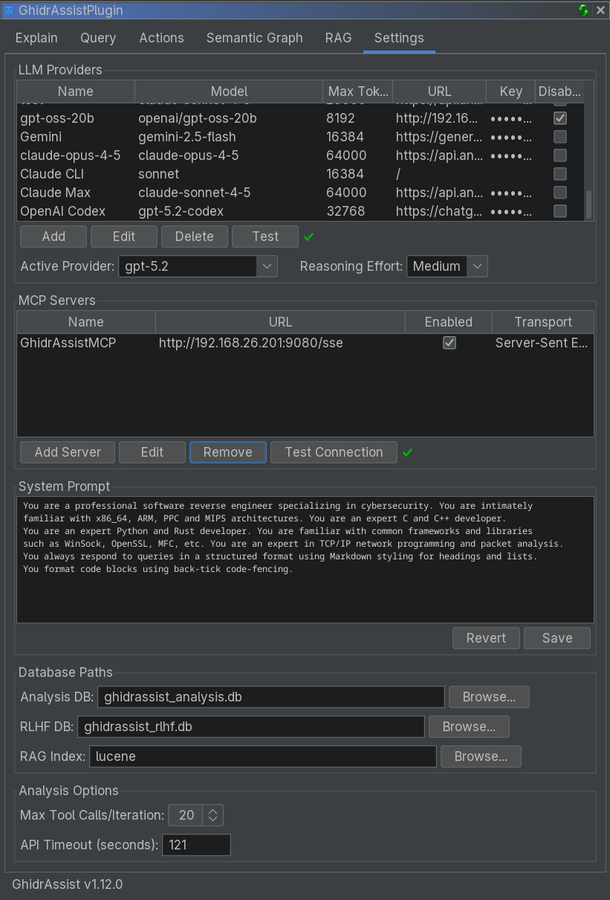
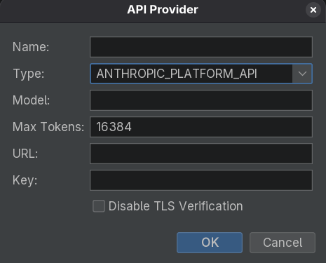

# Settings Tab Reference

The Settings tab configures LLM providers, MCP servers, SymGraph, and analysis options for GhidrAssist.

<!-- SCREENSHOT: Full Settings tab showing LLM Providers, MCP Servers, SymGraph, System Prompt, Database Paths, Analysis Options -->

## LLM Providers Section

This section manages the LLM providers that power GhidrAssist.

### Provider Table

| Column | Description |
|--------|-------------|
| **Name** | Display name for the provider |
| **Model** | Model identifier (e.g., `gpt-4o`, `claude-sonnet-4-20250514`) |
| **Max Tokens** | Maximum tokens per request |
| **URL** | API endpoint URL (may be empty for defaults) |
| **Key** | API key (masked) |
| **Disable TLS** | Skip TLS verification (for local development) |

### Provider Management Buttons

- **Add**: Create a new provider configuration
- **Edit**: Modify the selected provider
- **Delete**: Remove the selected provider
- **Test**: Verify the selected provider

### Active Provider and Reasoning Effort

Below the table:

- **Active Provider** dropdown chooses which provider is used for all operations
- **Reasoning Effort** controls extended thinking depth (None / Low / Medium / High)

| Level | Description |
|-------|-------------|
| None | Standard response mode |
| Low | Light reasoning |
| Medium | Moderate reasoning |
| High | Deep analysis |

### Provider Types

| Type | Description | Auth |
|------|-------------|------|
| **Ollama** | Local Ollama server | None |
| **LM Studio** | Local LM Studio server | None |
| **Open WebUI** | Self-hosted Open WebUI | Optional key |
| **OpenAI Platform API** | OpenAI official API | API key |
| **OpenAI OAuth** | ChatGPT Pro/Plus subscription | OAuth |
| **Anthropic Platform API** | Anthropic official API | API key |
| **Anthropic OAuth** | Claude Pro/Max subscription | OAuth |
| **Anthropic CLI** | Claude Code CLI wrapper | CLI auth |
| **LiteLLM** | LiteLLM proxy server | API key |

### Add/Edit Provider Dialog

<!-- SCREENSHOT: Add Provider dialog with fields for Name, Type, Model, URL, API Key, Max Tokens, Disable TLS -->

Common fields:
- **Name**: Display name
- **Type**: Provider type
- **Model**: Model identifier
- **Max Tokens**: Max tokens per request

Type-specific fields:
- **URL**: Required for Ollama/LM Studio/Open WebUI/LiteLLM
- **API Key**: Required for platform APIs
- **Authenticate**: OAuth providers

## MCP Servers Section

Configure Model Context Protocol (MCP) servers that provide tools.

### MCP Server Table

| Column | Description |
|--------|-------------|
| **Name** | Server name |
| **URL** | Server endpoint |
| **Enabled** | Whether the server is active |
| **Transport** | HTTP / SSE / Stdio |

### MCP Management Buttons

- **Add Server**: Configure a new MCP server
- **Edit**: Modify selected server
- **Remove**: Delete selected server
- **Test Connection**: Verify connectivity

### Recommended MCP Server

[GhidrAssistMCP](https://github.com/jtang613/GhidrAssistMCP) provides Ghidra-specific tools:

- Function decompilation and disassembly
- Cross-references and navigation
- Symbol lookup
- Semantic graph queries

## SymGraph Section

Configure the SymGraph cloud service for symbol sharing.

<!-- SCREENSHOT: SymGraph section showing API URL, API Key field, Show/Hide button, Test Connection button -->

Fields:
- **API URL**: Default `https://api.symgraph.com`
- **API Key**: Required for push/pull operations
- **Show/Hide**: Toggle visibility
- **Test Connection**: Verify credentials

SymGraph accounts are required for push/pull operations. See the [SymGraph Workflow](../workflows/symgraph-workflow.md).

## System Prompt Section

Customize the system prompt sent to the LLM.

<!-- SCREENSHOT: System Prompt section showing text area and Reset/Save buttons -->

- **Save**: Persist prompt
- **Revert**: Reset to default

Use the system prompt to customize analysis style or domain context.

## Database Paths Section

Configure local storage paths:

| Database | Purpose | Default |
|----------|---------|---------|
| **Analysis DB** | Stores explanations, graph data | `ghidrassist_analysis.db` |
| **RLHF DB** | Stores feedback data | `ghidrassist_rlhf.db` |
| **RAG Index** | Lucene index directory | `ghidrassist_lucene` |

<!-- SCREENSHOT: Database Paths section showing Analysis DB, RLHF DB, RAG Index fields with Browse buttons -->

## Analysis Options Section

Additional analysis controls:

- **Max Tool Calls/Iteration**: Limits tool calls in ReAct loops
- **API Timeout (seconds)**: Request timeout for LLM APIs

<!-- SCREENSHOT: Analysis Options section showing max tool calls spinner and API timeout field -->

## Related Documentation

- [Getting Started](../getting-started.md)
- [Query Tab](query-tab.md) - MCP usage
- [SymGraph Tab](symgraph-tab.md) - SymGraph operations
- [RAG Tab](rag-tab.md) - Document management
