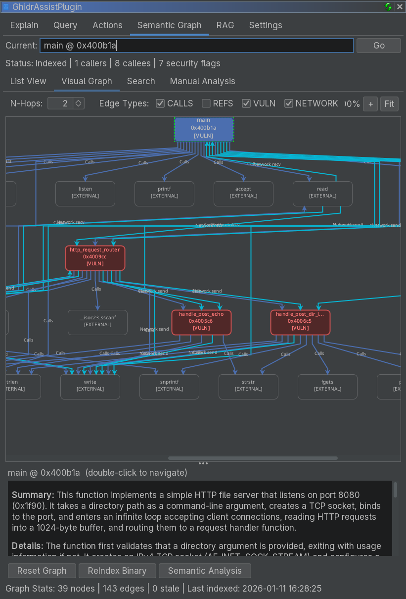

# Workflow: Building a Semantic Graph

This guide shows how to build and use GhidrAssist's semantic graph for structured analysis.

## Overview

The semantic graph captures:

- Function summaries and call relationships
- Security flags and activity profiles
- Taint and network flow paths
- Function communities

It can be used directly in the Semantic Graph tab or via MCP queries.

## Step-by-Step Workflow

### Step 1: Open the Semantic Graph Tab

Navigate to the Semantic Graph tab in GhidrAssist.

### Step 2: ReIndex the Binary

Click **ReIndex Binary** to build the initial graph.

This extracts:
- Functions and addresses
- Call relationships
- Imports/exports

### Step 3: Run Semantic Analysis

Click **Semantic Analysis** to generate LLM summaries and security metadata.

### Step 4: Run Security Analysis

From the Manual Analysis panel, click **Security Analysis** to find source-to-sink paths.

### Step 5: Run Network Flow Analysis

Click **Network Flow Analysis** to track data flow through network send/recv APIs.

### Step 6: Run Community Detection

Click **Community Detection** to group related functions using Label Propagation.

## Exploring the Graph

### List View

- Browse all functions and summaries
- Review security flags
- Navigate directly to code

### Visual Graph

- Explore relationships visually
- Adjust depth and focus on critical nodes

<!-- SCREENSHOT: Visual graph with nodes, edges, selected function -->

### Search

Search summaries and function names:

## Using the Graph in Queries

With MCP enabled in Query tab, the LLM can:
- Search summaries
- Find related functions
- Trace call chains
- Identify risky code paths

## Related Documentation

- [Semantic Graph Tab Reference](../tabs/semantic-graph-tab.md)
- [Query Workflow](query-workflow.md)
